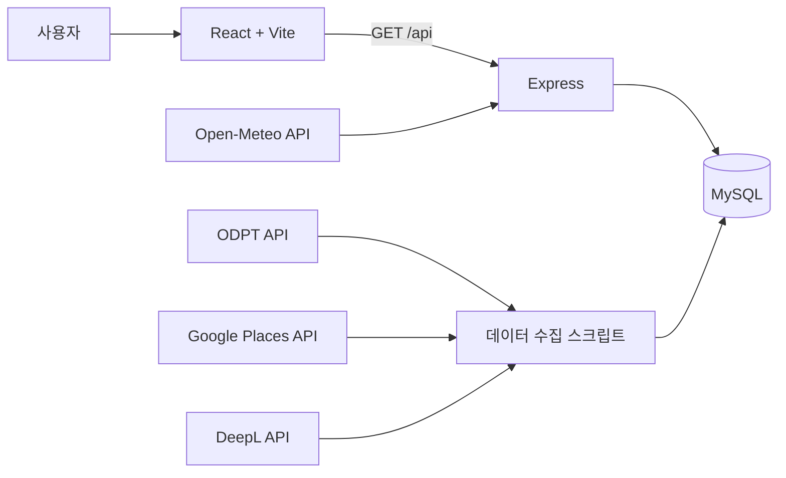

<div align="center">

# SkyLiner

**도쿄 지하철 노선도에서 역·시간표·주변 장소·날씨를 조회하는 웹 애플리케이션**

학교에서 처음 진행한 웹 팀 프로젝트의 구현 내용과 한계를 현재 시점에서 다시 정리한 저장소입니다.


</div>

> **Project Status: Incomplete / Archived**
>
> 학교에서 처음 진행한 웹 팀 프로젝트로, 일부 기능은 구현을 완료하지 못했습니다. 현재 기준에서는 코드 구조, 예외 처리, 테스트, 데스크톱 대응 등에 개선할 부분이 있습니다. 이 저장소는 완성된 서비스가 아니라 당시 실제로 구현한 범위와 개발 과정에서 얻은 경험을 기록하기 위해 정리했습니다.

## Contents

- [Overview](#overview)
- [Feature Status](#feature-status)
- [Main Flow](#main-flow)
- [Architecture](#architecture)
- [Tech Stack](#tech-stack)
- [API Scope](#api-scope)
- [Database](#database)
- [Getting Started](#getting-started)
- [Current Limitations](#current-limitations)
- [Verification](#verification)
- [Retrospective](#retrospective)
- [Team & Contribution](#team--contribution)

## Overview

SkyLiner는 도쿄 지하철 이용자가 노선도에서 역을 선택해 다음 열차와 주변 관광 정보를 확인할 수 있도록 기획한 웹 애플리케이션입니다.

React 화면과 Express API, MySQL 데이터베이스를 연결했으며, ODPT·Google Places·Open-Meteo 등의 외부 데이터를 수집하는 스크립트도 작성했습니다. 다만 사용자 화면에서 연결된 기능과 백엔드에만 구현된 기능이 섞여 있고, 검색·길찾기·관리자 기능 등은 완성되지 않았습니다.

- 개발 기간: 2025.10 ~ 2025.12 (Git 기록 기준)
- 형태: 학교 팀 프로젝트
- 화면에 표현한 노선: 도쿄 메트로 마루노우치선·히비야선
- 현재 운영 여부: 운영하지 않음

## Feature Status

### Implemented

- 마루노우치선·히비야선을 표현한 SVG 노선도
- 노선도 확대·축소 및 이동
- 모바일 환경에서 역 노드를 터치해 역 정보 바텀시트 표시
- 역 코드에 따른 역명, 노선, 이전·다음 역 조회
- 현재 시각 이후의 열차 시간표 조회
- 역 상세 화면에서 날씨와 주변 장소 목록 조회
- 평점순 장소 목록과 장소 상세 정보 조회
- 역, 장소, 시간표, 날씨, 환승 정보를 조회하는 Express API
- MySQL 테이블 스키마와 외부 데이터 수집 스크립트
- Open-Meteo 날씨 데이터를 30분마다 갱신하는 서버 작업

### Partially Implemented

- **데스크톱 화면**: 데스크톱용 바텀시트 컴포넌트는 작성했지만 실제 분기에서 렌더링이 주석 처리되어 있습니다. 지도 역 선택 이벤트도 터치 이벤트 위주로 연결되어 있습니다.
- **경로 탐색**: 백엔드에 최단 시간과 최소 환승 경로 계산 로직 및 조회 API가 있으나, 사용자 화면은 구현되지 않았습니다. 프론트엔드 API 함수와 서버 엔드포인트 형식도 서로 일치하지 않습니다.
- **환승 시간**: 환승 정보 생성 스크립트가 모든 환승 시간을 임시값인 3분으로 저장하므로 실제 이동 시간을 반영하지 않습니다.
- **데이터 동기화**: ODPT, Google Places, DeepL 등의 API와 로컬 MySQL 환경이 준비되어야 실행할 수 있습니다. 외부 API 응답이나 데이터 상태에 대한 충분한 예외 처리는 확인되지 않았습니다.
- **역·시간표 정보 UI**: 주요 정보는 표시하지만 상세 영역 일부에는 임시 텍스트가 남아 있습니다.
- **반응형 UI**: 모바일 중심으로 작성되었으며 화면 크기별 동작과 레이아웃이 충분히 검증되지 않았습니다.

### Planned / Not Completed

- 역 검색 입력과 검색 결과 처리
- 길찾기 화면 및 사용자 입력 흐름
- 관리자 페이지와 관리 기능
- 데스크톱 바텀시트 연결
- 역 상세 정보의 나머지 콘텐츠
- 배포 환경 구성
- 자동화된 단위·통합·E2E 테스트

## Main Flow

1. 사용자가 노선도에서 역을 선택합니다.
2. 프론트엔드가 역 코드를 이용해 역 정보와 다음 열차를 요청합니다.
3. 바텀시트에서 역 요약 정보를 확인하거나 역 상세 화면으로 이동합니다.
4. 역 상세 화면에서 날씨와 주변 장소를 조회합니다.
5. 장소 카드를 선택하면 평점, 주소, 연락처, 영업시간 등의 상세 정보를 확인합니다.

## Architecture



외부 API 데이터를 수집해 MySQL에 저장하고, 프론트엔드는 Express의 조회 API를 통해 데이터를 받아 표시하는 구조입니다. 외부 API를 브라우저에서 직접 호출하지 않도록 구성했지만, 운영 환경을 고려한 배포·보안·모니터링 구성까지 구현한 프로젝트는 아닙니다.

## Tech Stack

### Frontend

- React 19
- Vite 7
- React Router
- Motion / Framer Motion
- React Zoom Pan Pinch
- CSS

### Backend

- Node.js
- Express 5
- MySQL2
- Axios
- node-cron

### Data Sources

- ODPT API: 도쿄 메트로 노선, 역, 시간표 데이터
- Google Places API: 역 주변 장소 정보
- Open-Meteo API: 현재 날씨
- DeepL API: 일부 수집 데이터 번역

## API Scope

현재 서버 라우트는 조회 기능만 제공합니다. 데이터 수집 스크립트가 DB에 데이터를 저장하지만, 사용자를 위한 생성·수정·삭제 API는 구현되어 있지 않으므로 완전한 CRUD API로 볼 수 없습니다.

| 영역 | Method | Endpoint | 상태 |
| --- | --- | --- | --- |
| 장소 | GET | `/api/places` | 화면에서 사용 |
| 장소 | GET | `/api/places/search` | API만 구현, 검색 UI 미연결 |
| 장소 | GET | `/api/places/:id` | 화면에서 사용 |
| 역 | GET | `/api/stations` | API 구현 |
| 역 | GET | `/api/stations/by-code/:stationCode` | 화면에서 사용 |
| 역 | GET | `/api/stations/:id` | API 구현 |
| 역 | GET | `/api/stations/:id/places` | 화면에서 사용 |
| 역 | GET | `/api/stations/:id/weather` | 화면에서 사용 |
| 역 | GET | `/api/stations/:id/transfers` | API 구현 |
| 노선 | GET | `/api/stations/lines/all` | API 구현 |
| 시간표 | GET | `/api/timetable/:stationCode` | API 구현 |
| 시간표 | GET | `/api/timetable/:stationCode/next` | 화면에서 사용 |
| 시간표 | GET | `/api/timetable/:stationCode/stats` | API 구현 |
| 경로 | GET | `/api/routes/search` | 백엔드만 구현 |
| 경로 | GET | `/api/routes/compare` | 백엔드만 구현 |

## Database

주요 테이블은 다음과 같습니다.

- `lineInfo`: 노선 정보
- `stationInfo`: 역 기본 정보
- `stationByLineInfo`: 노선별 역 코드와 순서
- `stationConnectionInfo`: 인접 역 연결 정보
- `stationTimeInfo`: 역별 시간표
- `transferInfo`: 환승 연결과 소요 시간
- `connectingRailwayInfo`: 연결 노선 정보
- `placeInfo`: 장소 정보
- `stationNearByInfo`: 역과 주변 장소의 관계
- `placeOpeningInfo`: 장소 영업시간
- `weatherInfo`: 역별 날씨
- `sync_logs`: 데이터 동기화 기록

## Getting Started

이 프로젝트는 프론트엔드만 실행하면 API 데이터가 표시되지 않습니다. MySQL 데이터베이스와 백엔드 환경 설정이 함께 필요합니다.

### 1. Install dependencies

```bash
# frontend
npm install

# backend
cd server
npm install
```

### 2. Create the database

MySQL에서 `server/database/subway_project.sql`을 실행합니다.

### 3. Configure environment variables

`server/.env` 파일을 만들고 필요한 값을 설정합니다.

```env
DB_HOST=localhost
DB_USER=your_user
DB_PASSWORD=your_password
DB_NAME=your_database
DB_PORT=3306

ODPT_API_KEY=your_odpt_key
GOOGLE_PLACES_API_KEY=your_google_places_key
DEEPL_API_KEY=your_deepl_key

PORT=5000
NODE_ENV=development
```

API 키가 필요한 전체 데이터 동기화는 외부 서비스의 정책과 사용량을 확인한 뒤 실행해야 합니다.

```bash
cd server
npm run sync
```

### 4. Run the application

터미널 두 개에서 백엔드와 프론트엔드를 각각 실행합니다.

```bash
# backend: http://localhost:5000
cd server
npm run dev
```

```bash
# frontend
npm run dev
```

개발 환경에서는 Vite가 `/api` 요청을 `http://localhost:5000`으로 전달합니다.

## Current Limitations

- 화면에서 사용하는 데이터는 로컬 DB와 외부 API 수집 결과에 의존합니다.
- 로딩 실패나 빈 데이터에 대한 안내가 화면별로 일관되지 않습니다.
- 라우트 이동 시 식별자를 URL이 아닌 `location.state`로 전달해 새로고침이나 직접 접근에 취약합니다.
- 프론트엔드의 API 호출 방식이 공통 API 모듈과 직접 `fetch` 호출로 나뉘어 있습니다.
- 경로 탐색 API의 프론트엔드 함수와 서버 라우트 규격이 맞지 않습니다.
- 컴포넌트 내부에 데이터 변환과 API 호출이 함께 있어 역할 분리가 충분하지 않습니다.
- 입력값 검증과 서버 오류 응답 형식이 라우트별로 일관되지 않습니다.
- 서버 시작 시 모든 역의 날씨를 갱신하므로 DB나 네트워크 문제의 영향을 받을 수 있습니다.
- 테스트 코드가 npm 테스트 체계에 연결되어 있지 않습니다.

## Verification

2026-08-28에 현재 체크아웃을 기준으로 다음 항목을 확인했습니다.

- `npm run build`: 통과
- `npm run lint`: 실패 — 194 errors, 5 warnings
- 백엔드 `npm test`: 실제 테스트가 아닌 기본 placeholder 스크립트
- DB 및 외부 API 연동 테스트: 필요한 환경 변수와 실행 중인 DB가 없어 미실행

린트 오류에는 CommonJS 서버 코드를 브라우저 전용 ESLint 설정으로 검사하면서 발생한 항목도 포함됩니다. 그 외에도 사용하지 않는 코드, Hook 규칙 위반, 의존성 경고, 현재 빌드에서 참조되지 않는 파일의 문법 오류가 남아 있습니다. 따라서 빌드 성공만으로 전체 기능이 정상 동작한다고 판단할 수 없습니다.

## Retrospective

첫 팀 프로젝트였기 때문에 초기에는 기능을 화면에 구현하고 API와 DB를 연결하는 데 집중했습니다. 그 과정에서 프론트엔드, 백엔드, 데이터베이스, 외부 API가 하나의 기능으로 이어지는 전체 흐름을 경험할 수 있었습니다.

### 아쉬웠던 점

- 구현 범위에 비해 검색, 경로 탐색, 장소, 날씨, 번역 등 다루려는 기능이 많았습니다.
- 화면과 API 계약을 먼저 정리하지 않아 일부 엔드포인트와 호출 코드가 맞지 않게 되었습니다.
- 모바일과 데스크톱 동작을 함께 완성하지 못했습니다.
- 샘플 데이터에서 실제 API 데이터로 전환한 흔적과 사용하지 않는 코드가 함께 남았습니다.
- 오류 처리, 접근성, 테스트, 환경 설정 문서화를 충분히 챙기지 못했습니다.
- 기능별 책임이 컴포넌트와 스크립트에 분산되어 유지보수하기 어려운 부분이 생겼습니다.

### 배운 점

- 개발 전에 MVP 범위와 완료 기준을 정하는 것이 중요합니다.
- 프론트엔드와 백엔드가 공유할 API 요청·응답 형식을 먼저 합의해야 합니다.
- 외부 API는 성공 응답뿐 아니라 키 누락, 호출 제한, 빈 데이터, 지연 상황도 고려해야 합니다.
- 데이터 수집 작업과 사용자 요청을 처리하는 서버 로직은 분리할 필요가 있습니다.
- 화면 구현과 함께 테스트, 린트, 오류 상태를 지속적으로 확인해야 마지막 통합 단계의 부담을 줄일 수 있습니다.

## Team & Contribution

이 저장소는 팀 전체의 결과물입니다. Git 기록에는 여러 작성자가 확인되지만, 커밋 기록만으로 각 기능의 기획·구현·수정 담당자를 정확히 판단하기 어려워 개인 기여 범위는 임의로 작성하지 않았습니다.

개인 포트폴리오에 사용할 경우 당시의 역할 분담 문서나 팀원과의 확인을 바탕으로 본인이 직접 담당한 항목만 별도로 추가하는 것이 좋습니다.
